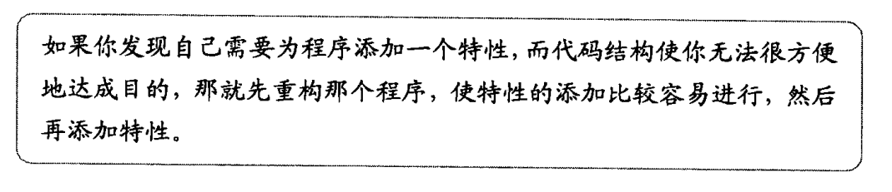
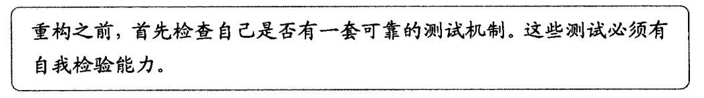
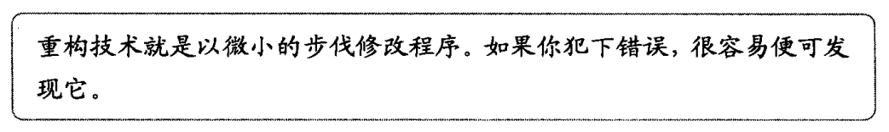
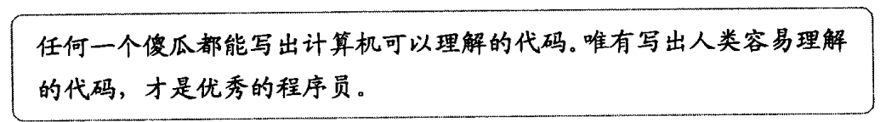
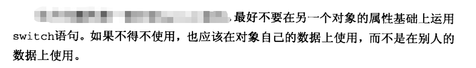

# 重构的定义

在不改变代码的外在行为的前提下，对代码进行修改，以改进程序的结构。

# 重构的建议

重构完后需要测试。

## 关于条件逻辑

# 参考

[GitHub - AijiangyoubuAicu/refactoring: 重构：改善既有代码的设计](https://github.com/AijiangyoubuAicu/refactoring)

[GitHub - xianweics/refator-code: 重构 - 改善既有代码的设计](https://github.com/xianweics/refator-code)

